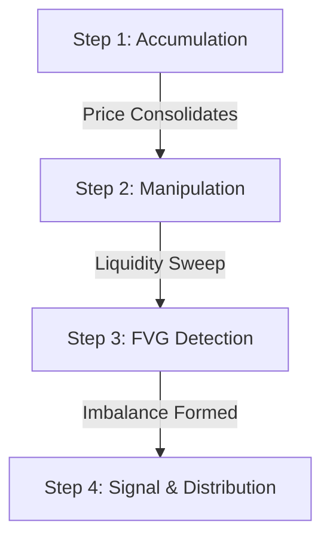

# AMD·FVG — Smart Money Concepts Indicator

## Accumulation · Manipulation · Distribution + Fair Value Gap

A professional ICT/SMC-based TradingView indicator that detects the full AMD cycle and generates high-probability trade signals at Fair Value Gaps.

---

## Overview

The **AMD (Accumulation, Manipulation, Distribution)** framework is a cornerstone of Smart Money Concepts (SMC) and Inner Circle Trader (ICT) methodologies. It describes the typical daily and session-based lifecycle of price delivery:

1. **Accumulation:** Smart money accumulates large positions within a tight consolidation range. Retail traders are encouraged to trade breakouts of this range in both directions, building up liquidity (stop losses) just outside the boundaries.
2. **Manipulation:** Price violently sweeps past the accumulation boundaries to trigger retail stop losses and activate pending breakout orders. This "stop hunt" creates the liquidity required for institutional participants to fill their opposite orders.
3. **Distribution:** Once liquidity is secured, price reverses and distributes aggressively in the true intended direction, trending toward distant target zones.

### The Role of Fair Value Gaps (FVG)
An **FVG (Fair Value Gap)** occurs during the early stage of the Distribution phase when an imbalance is created between buying and selling pressure. This leaves an unfilled gap on the chart (between the high of bar 2 and the low of bar 0 for bullish impulses). 

### Why the 1-Hour Timeframe?
The 1-Hour (1H) timeframe is highly optimized for the AMD framework. Consolidation ranges are cleaner, stop sweeps are less prone to noise, and FVGs represent major institutional order flow shifts. This timeframe balances intraday execution with macro direction, resulting in higher probability signals.

---

## How It Works

The indicator operates in a 4-step sequence to track order flow and signal entries:

### Step 1 — Accumulation Detection
The script monitors rolling high and low values over a user-defined lookback window. If the range percentage is within the defined threshold, consolidation is confirmed. A **blue accumulation box** is drawn and dynamically extends to the right as long as consolidation remains active.

### Step 2 — Manipulation Detection
Once accumulation ends, the script monitors price actions within a specified detection window.
* **Bullish Manipulation:** Price sweeps below the accumulation low, grabbing buy stops, then closes back inside the range.
* **Bearish Manipulation:** Price sweeps above the accumulation high, grabbing sell stops, then closes back inside the range.
A **red manipulation zone** highlights the stop-hunt candle.

### Step 3 — FVG Detection
Following manipulation, the script watches for a strong displacement candle that breaks the range and creates an imbalance (FVG):
* **Bullish FVG:** The high of candle [2] is strictly less than the low of candle [0], representing a buying imbalance.
* **Bearish FVG:** The low of candle [2] is strictly greater than the high of candle [0], representing a selling imbalance.
A **dashed green (bullish) or red (bearish) box** is drawn, dynamically tracking the gap. If price fills the gap or the FVG exceeds the maximum age, the box turns dotted and fades out.

### Step 4 — Signal Generation
* **Formation Signal:** Fired immediately when the FVG forms.
* **Touch Signal (Default):** Fired on subsequent bars when price pulls back to test the FVG zone.
* **Stop Loss:** Placed dynamically at an ATR-multiplier distance beyond the manipulation wick low (long) or high (short).
* **Targets:** Placed as Fibonacci extensions of the manipulation range (T1 = 1.0R | T2 = 1.5R | T3 = 2.0R).

---

## Signal Types

| Signal | Color | Condition | Action |
| :--- | :--- | :--- | :--- |
| **LONG** | 🟢 Green | Bull manipulation + Bull FVG touch/formation | Enter Long position |
| **SHORT** | 🔴 Red | Bear manipulation + Bear FVG touch/formation | Enter Short position |
| **FVG ZONE** | 🟡 Gold | Price returns to active FVG area (non-signal touch) | Prepare entry / Watch PA |
| **NO SIGNAL** | ⚪ Grey | Sequence incomplete or FVG expired/mitigated | Wait for new AMD cycle |

---

## Visual Elements on Chart

| Element | Color | Meaning |
| :--- | :--- | :--- |
| **Accumulation Zone Box** | Blue | Price consolidation area |
| **Manipulation Zone Box** | Red | Stop hunt / liquidity sweep range |
| **FVG Box** | Green / Red | Active Fair Value Gap zone |
| **▲ LONG Label** | Green | Enter Long signal with R:R estimation |
| **▼ SHORT Label** | Red | Enter Short signal with R:R estimation |
| **SL Line** | Dashed Red | Stop loss level beyond manipulation wick |
| **T1 / T2 / T3 Lines** | Gold Dotted | Fibonacci-based distribution target levels |
| **Phase Dashboard** | Gold Frame / Dark Bg | Bottom-right panel showing current phase status |

---

## Settings & Inputs

### AMD Settings
| Parameter | Default | Description |
| :--- | :--- | :--- |
| `Accumulation Lookback (bars)` | `20` | Number of bars to check for consolidation range |
| `Accumulation Range Threshold (%)` | `0.5%` | Maximum height percentage to qualify as consolidation |

### Manipulation Settings
| Parameter | Default | Description |
| :--- | :--- | :--- |
| `Wick Multiplier for Stop Hunt` | `1.5` | Sensitivity multiplier for detecting sweeps relative to ATR |
| `Manipulation Detection Window (bars)` | `5` | Maximum bars allowed after accumulation ends to detect manipulation |

### FVG Settings
| Parameter | Default | Description |
| :--- | :--- | :--- |
| `Minimum FVG Size (%)` | `0.1%` | Smallest gap size to qualify as a valid imbalance |
| `FVG Max Age (bars)` | `10` | Maximum lifetime of an FVG zone before it expires |
| `Show FVG Boxes on Chart` | `true` | Toggles the drawing of FVG boxes |

### Signal Settings
| Parameter | Default | Description |
| :--- | :--- | :--- |
| `Signal on FVG Touch (vs FVG Formation)` | `true` | Wait for price to touch the FVG zone vs signaling on formation |
| `Stop Loss ATR Multiplier` | `0.5` | Offset multiplier beyond the manipulation wick for Stop Loss |
| `Show Stop Loss Line` | `true` | Toggles drawing of the SL line |
| `Show Target Levels` | `true` | Toggles drawing of T1, T2, and T3 lines |

---

## Recommended Settings by Asset

| Asset | Acc Threshold | Wick Mult | Notes |
| :--- | :--- | :--- | :--- |
| **XAUUSD (Gold)** | 0.8% - 1.2% | 1.5 | Optimized for higher intraday volatility |
| **EURUSD** | 0.2% - 0.4% | 1.3 | Optimized for tight spreads and major FX pairs |
| **GBPUSD** | 0.3% - 0.5% | 1.5 | Accounts for medium session volatility |
| **BTCUSDT** | 1.0% - 1.5% | 1.8 | High volatility crypto major asset |
| **ETHUSDT** | 1.2% - 2.0% | 2.0 | High range flexibility for crypto assets |

---

## Setting Up Alerts

Follow these steps to configure real-time alerts on your TradingView account:

1. Copy and add the indicator to your chart.
2. Right-click anywhere on the chart area and click **Add Alert**.
3. In the **Condition** dropdown, select **AMD·FVG**.
4. Choose one of the pre-configured alert conditions:
   * `AMD·FVG — LONG SIGNAL`
   * `AMD·FVG — SHORT SIGNAL`
   * `AMD·FVG — FVG DETECTED` (Early warning)
   * `AMD·FVG — PRICE IN FVG ZONE` (Entry warning)
5. Select your preferred actions (e.g., *Show Pop-up*, *Send Email*, *Webhook URL*).
6. Click **Create** to activate.

---

## Installation

### Method 1 — TradingView Indicators Library
1. Open a chart on **TradingView.com**.
2. Click **Indicators** at the top panel.
3. Search for `"AMD·FVG RehanFX"` or `"AMD·FVG — Smart Money Concepts"`.
4. Click on the indicator to add it to your chart.

### Method 2 — Manual Pine Editor Paste
1. Open your chart on **TradingView**.
2. Click on the **Pine Editor** tab at the bottom panel.
3. Delete any default template and paste the complete script from `AMD_FVG_Indicator.pine`.
4. Click **Save** and then click **Add to chart**.
5. Set your chart timeframe to **1H** for optimal performance.

---

## Important Notes

* **Timeframe Optimization:** This indicator is specifically designed and optimized for the **1-Hour (1H)** timeframe. Using it on lower timeframes (e.g., 5m, 15m) might require custom input adjustments.
* **Dashboard Warning:** If you load the indicator on a timeframe other than 1H, a warning indicator will appear in red in the bottom-right table.
* **Session Convergence:** AMD cycles are highly correlated to market sessions. Signals that occur during the London Open or New York Open are significantly higher probability.
* **Risk Management:** Never risk more than 1% to 2% of your capital per trade. Use the dynamic R:R calculator shown on the entry labels.
* **News Events:** Avoid taking entries right before or during major high-impact news releases (e.g., FOMC, NFP, CPI).

---

## Disclaimer

> [!WARNING]
> **Financial Risk Warning:**
> This indicator is designed for educational and analytical purposes only. It does not constitute financial, investment, or trading advice. Trading Forex, Crypto, and CFDs carries a high level of risk and may not be suitable for all investors. You risk losing some or all of your invested capital. Always perform your own research and practice proper risk management. Past performance is not indicative of future results.

---

## Author & Credits

| Attribute | Details |
| :--- | :--- |
| **Author** | Muhammad Rehan Afzal |
| **Alias** | RehanFX_Alpha |
| **GitHub** | [github.com/rehanqx](https://github.com/rehanqx) |
| **Portfolio** | [trade.monsternetwork.site](https://trade.monsternetwork.site) |
| **Organization** | TeamCyberOps |
| **Academy** | TCO Academy |

## License

This project is licensed under the **MIT License** — free to use, modify, and distribute with attribution.
